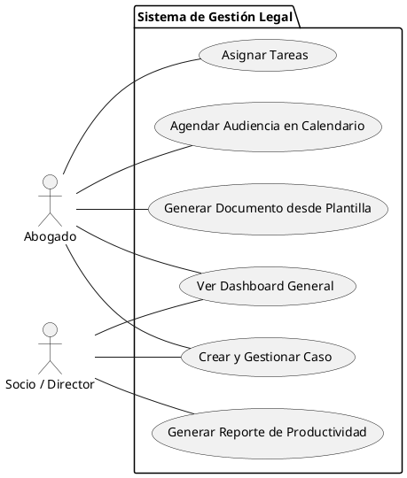

¡Excelente iniciativa\! Un PRD claro y conciso es fundamental para el éxito de un proyecto. A continuación, te presento una versión mejorada del documento, enfocada en la brevedad y la claridad, junto con los diagramas en PlantUML que solicitaste.

-----

# PRD: Sistema de Gestión Legal (SGL)

## 1\. Visión y Objetivos

### 1.1. Visión del Producto

Una plataforma SaaS centralizada que permite a despachos jurídicos y abogados independientes optimizar la gestión de sus casos, automatizar tareas administrativas y tomar decisiones basadas en datos.

### 1.2. Objetivos de Negocio

  - **Reducir el tiempo administrativo** en un 30% mediante la automatización.
  - **Incrementar la productividad** del equipo legal en un 25%.
  - **Centralizar el 100% de la información** de los casos para eliminar la dispersión de datos.
  - **Mejorar la toma de decisiones** estratégicas con reportes en tiempo real.

## 2\. Alcance y Módulos

El sistema se compone de los siguientes módulos principales, apoyados por funcionalidades transversales.

| Módulo Principal | Descripción Breve |
| :--- | :--- |
| **Dashboard (Panorama)** | Vista de pájaro con KPIs, alertas y accesos rápidos a casos prioritarios. |
| **Gestión de Casos** | Núcleo del sistema para administrar expedientes, clientes y documentos. |
| **Gestión de Tareas** | Organización y seguimiento de todas las actividades y fechas de vencimiento. |
| **Calendario Jurídico** | Agenda unificada para audiencias, citas y eventos importantes. |
| **Reportes y Analítica**| Generación de informes de rendimiento, financieros y operativos. |
| **Gestión de Plantillas** | Creación y uso de documentos legales estandarizados para agilizar el trabajo. |

**Funcionalidades Transversales:** Autenticación y roles de usuario, notificaciones, búsqueda global y seguridad de datos.

## 3\. Requisitos Funcionales Detallados

### 3.1. Gestión de Casos

El corazón del sistema. Permite un manejo integral del ciclo de vida de un expediente legal, relacionando clientes, tareas, documentos y eventos.

**Diagrama de Entidades Principales**

Este diagrama muestra cómo se relacionan las entidades clave dentro del módulo de gestión de casos.

diagrama 1
### 3.2. Requisitos por Módulo

| Módulo | Funcionalidades Clave | Criterios de Aceptación Principales |
| :--- | :--- | :--- |
| **Dashboard** | - KPIs (casos activos/cerrados, tareas vencidas).\<br\>- Lista de próximos vencimientos.\<br\>- Gráfico de distribución de casos. | Carga en \< 3s. Datos en tiempo real. |
| **Tareas** | - Vista de tareas (Kanban/Lista).\<br\>- Asignación, prioridades y fechas límite.\<br\>- Vinculación a casos.\<br\>- Recordatorios automáticos. | Notificaciones push/email. Creación de tareas recurrentes. |
| **Calendario** | - Vistas (mes/semana/día).\<br\>- Creación de eventos (audiencias, citas).\<br\>- Sincronización con Google/Outlook. | Sincronización bidireccional. Reprogramación drag-and-drop. |
| **Reportes** | - Productividad por abogado.\<br\>- Rentabilidad por caso.\<br\>- Tiempo de resolución promedio.\<br\>- Exportación a PDF/Excel. | Generación programada. Visualizaciones interactivas. |
| **Plantillas** | - Biblioteca de plantillas.\<br\>- Editor WYSIWYG con campos dinámicos (e.g., `${cliente.nombre}`).\<br\>- Generación de documentos en Word/PDF. | Más de 20 plantillas base. Creación de plantillas personalizadas ilimitadas. |

## 4\. Casos de Uso Principales

A continuación se visualizan las interacciones clave de los usuarios con el sistema.

**Diagrama de Casos de Uso**



**Flujos Clave:**

1.  **Crear Nuevo Caso:** Un `Abogado` registra un nuevo cliente y los detalles del caso. El sistema asigna un número de expediente y crea el espacio de trabajo digital.
2.  **Generar Reporte Mensual:** Un `Socio` accede al módulo de reportes, filtra por el período deseado y exporta un análisis de productividad y rentabilidad del despacho.
3.  **Programar Audiencia:** Un `Abogado` añade una audiencia al `Calendario`, la vincula a un caso y el sistema envía recordatorios automáticos al equipo y al cliente.

## 5\. Arquitectura e Integraciones

El sistema se diseñará sobre una arquitectura escalable y orientada a servicios, preparado para integrarse con herramientas externas clave.

**Diagrama de Contexto y Arquitectura**

```plantuml
@startuml

!define ICONURL https://raw.githubusercontent.com/tupadr3/plantuml-icon-font-sprites/v2.4.0
!includeurl ICONURL/common.puml
!includeurl ICONURL/devicons/mysql.puml
!includeurl ICONURL/font-awesome-5/database.puml
!includeurl ICONURL/font-awesome-5/users.puml
!includeurl ICONURL/font-awesome-5/server.puml
!includeurl ICONURL/font-awesome-5/envelope.puml
!includeurl ICONURL/font-awesome-5/google.puml


actor "<$users>\nUsuario" as User

package "Sistema de Gestión Legal (SGL)" #lightblue {
  component "Frontend (React/Vue)" as WebApp
  component "API Gateway" as Gateway
  
  rectangle "Backend (Microservicios)" as Backend {
    component "<$server>\nGestión Casos" as SvcCasos
    component "<$server>\nCalendario" as SvcCal
    component "<$server>\nReportes" as SvcRep
    component "<$server>\nNotificaciones" as SvcNotif
  }
  
  database "<$database>\nBase de Datos" as DB
}

package "Servicios Externos" {
    cloud "Sistemas Judiciales" as Gov
    cloud "<$google>\nGoogle/Outlook API" as CalendarAPI
    cloud "<$envelope>\nServidor SMTP" as SMTP
}


User -> WebApp : "Interactúa vía HTTPS"
WebApp -> Gateway : "Peticiones API"
Gateway -> Backend

SvcCasos -.> DB
SvcCal -.> DB
SvcRep -.> DB

Backend -> SvcNotif
SvcNotif -> SMTP : "Envía emails"
SvcCal <--> CalendarAPI : "Sincroniza eventos"
SvcCasos --> Gov : "Consulta expedientes (Opcional)"


@enduml
```

**Integraciones Clave:**

  - **Calendarios Externos:** Sincronización con Google Calendar y Outlook.
  - **Email:** Envío de notificaciones y recordatorios vía SMTP (SendGrid, Mailgun).
  - **Sistemas Judiciales:** Conectores (APIs) para consulta de expedientes públicos (cuando estén disponibles).
  - **Facturación:** API para futura integración con sistemas contables (QuickBooks, Xero).

## 6\. Requisitos No Funcionales

| Categoría | Requisito |
| :--- | :--- |
| **Rendimiento** | - Tiempo de respuesta de API \< 500ms (P95).\<br\>- Carga de página interactiva \< 3 segundos. |
| **Seguridad** | - Encriptación de datos en reposo y en tránsito.\<br\>- Autenticación de 2 Factores (2FA).\<br\>- Logs de auditoría de acciones críticas. |
| **Escalabilidad**| - Arquitectura Cloud-Native capaz de soportar un crecimiento de usuarios del 20% mensual.\<br\>- Base de datos con capacidad de escalado. |
| **Usabilidad** | - Diseño responsivo (móvil y escritorio).\<br\>- Interfaz intuitiva con una curva de aprendizaje menor a 2 horas.\<br\>- Búsqueda global y ayuda contextual. |

## 7\. Métricas de Éxito

  - **Adopción:** 80% de los usuarios activos semanalmente tras el primer mes.
  - **Rendimiento:** Uptime del sistema del 99.9%.
  - **Negocio:** Reducción del tiempo promedio en la creación de documentos en un 40%.